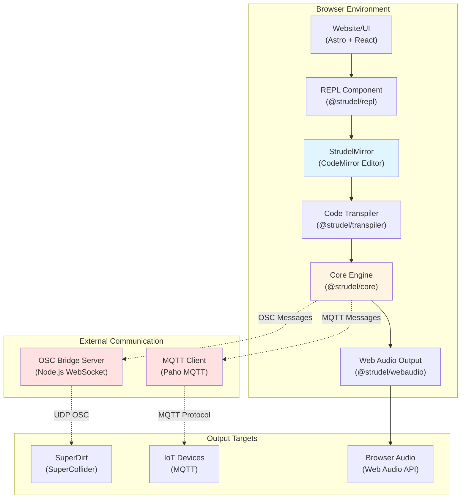
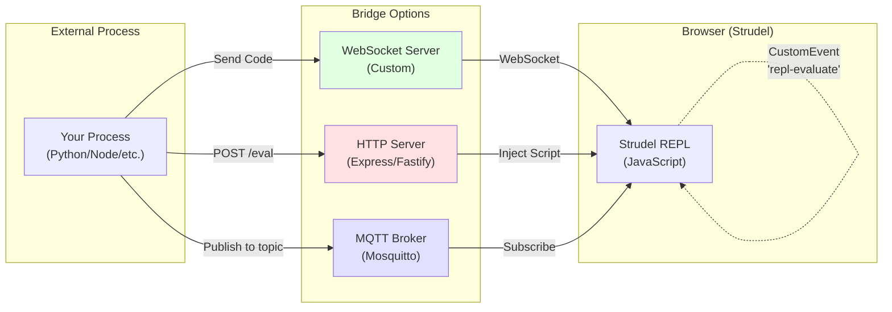

# Strudel Architecture Analysis

**Date:** 2025-12-25  
**Purpose:** Understand Strudel's architecture and identify methods for external programmatic control

## Project Overview

Strudel is a browser-based live coding environment for music/audio, inspired by TidalCycles. It's a monorepo project using:
- **Runtime:** Browser-based (Web Audio API)
- **Language:** JavaScript/TypeScript
- **Package Manager:** pnpm with lerna
- **Architecture:** Modular packages with a central REPL component

**Repository:** `https://codeberg.org/uzu/strudel`  
**Website:** `https://strudel.cc`  
**License:** AGPL-3.0-or-later

---

## Architecture Overview



---

## Key Components

### 1. REPL Component (`packages/repl/`)

**File:** `packages/repl/repl-component.mjs`

Defines a Web Component `<strudel-editor>` that wraps the entire REPL functionality:

```javascript
class StrudelRepl extends HTMLElement {
  static observedAttributes = ['code'];
  
  // Key methods:
  attributeChangedCallback(name, oldValue, newValue) {
    if (name === 'code') {
      this.code = newValue;
      this.editor?.setCode(newValue);  // ← Sets code programmatically
    }
  }
}
```

**Capabilities:**
- Accepts `code` attribute for initial/updated code
- Emits `update` CustomEvent when state changes
- Wraps `StrudelMirror` editor instance

---

### 2. StrudelMirror Editor (`packages/codemirror/codemirror.mjs`)

**Primary API Class:** `StrudelMirror`

This is the main programmable interface for controlling the REPL.

#### Key Public Methods:

```javascript
class StrudelMirror {
  // Code control
  setCode(code)              // Replace all code in editor
  appendCode(code)           // Append code at cursor position
  
  // Evaluation control
  evaluate(autostart = true) // Evaluate current code
  stop()                     // Stop playback
  toggle()                   // Toggle play/stop
  
  // Cursor control
  getCursorLocation()        // Get cursor position
  setCursorLocation(col)     // Set cursor position
  
  // Settings
  updateSettings(settings)   // Update editor settings
  setFontSize(size)
  setFontFamily(family)
  
  // Cleanup
  clear()                    // Remove event listeners
}
```

#### Event-Based Control (Custom Events)

**Critical Discovery:** The editor listens for global DOM events!

```javascript
// From packages/codemirror/codemirror.mjs:262-263
document.addEventListener('repl-evaluate', this.onEvaluateRequest);
document.addEventListener('repl-stop', this.onStopRequest);
document.addEventListener('repl-toggle-comment', this.onToggleComment);
```

**How it works:**

```javascript
this.onEvaluateRequest = (e) => {
  try {
    logger('[repl] evaluate via event');
    this.evaluate();
    e?.cancelable && e.preventDefault?.();
  } catch (err) {
    console.error('Error handling repl-evaluate event', err);
  }
};
```

---

## External Control Methods

### Method 1: DOM Custom Events (Easiest)

**How to trigger evaluation from outside:**

```javascript
// Trigger evaluation
const evalEvent = new CustomEvent('repl-evaluate', {
  detail: { source: 'external' },
  cancelable: true
});
document.dispatchEvent(evalEvent);

// Stop playback
const stopEvent = new CustomEvent('repl-stop', {
  detail: { source: 'external' },
  cancelable: true
});
document.dispatchEvent(stopEvent);
```

**To update code + evaluate:**

```javascript
// Method 1: Via Web Component attribute
const editor = document.querySelector('strudel-editor');
if (editor) {
  editor.setAttribute('code', 'note("c a f e").s("piano")');
  // Then trigger evaluation
  document.dispatchEvent(new CustomEvent('repl-evaluate'));
}

// Method 2: Via StrudelMirror instance (if accessible)
if (window.strudelEditor) {  // Assuming exposed globally
  window.strudelEditor.setCode('note("c a f e").s("piano")');
  window.strudelEditor.evaluate();
}
```

---

### Method 2: OSC Bridge (Existing, for audio output)

**Purpose:** Send audio events TO external software (SuperCollider/SuperDirt)
**Direction:** Strudel → External (one-way)

**File:** `packages/osc/osc.mjs`

```javascript
// Connects to WebSocket server on localhost:8080
const ws = new WebSocket('ws://localhost:8080');

// Sends OSC messages via WebSocket bridge
ws.send(JSON.stringify({
  address: '/dirt/play',
  args: keyvals,
  timestamp: ts
}));
```

**Server:** `packages/osc/server.js` (Node.js)
- Listens on WebSocket port 8080
- Forwards to OSC UDP port 57120 (SuperDirt)

**Limitation:** This is for AUDIO OUTPUT, not for controlling the REPL.

---

### Method 3: MQTT Integration (Existing, bidirectional potential)

**File:** `packages/mqtt/mqtt.mjs`

```javascript
// Pattern can publish to MQTT
Pattern.prototype.mqtt = function(username, password, topic, host, ...) {
  // Connects to MQTT broker (default: wss://localhost:8883/)
  const cx = new Paho.Client(host, client);
  
  // Sends pattern events as MQTT messages
  cx.send(message);
}
```

**Current State:** Only sends FROM Strudel TO MQTT (one-way)

**Potential Extension:** Could subscribe to MQTT topics and trigger code updates

---

### Method 4: WebSocket API (Not Implemented - Requires Custom Development)

**Proposal:** Create a WebSocket server in the browser or a companion server that:
1. Accepts incoming connections
2. Receives code update commands
3. Calls `strudelEditor.setCode()` and `evaluate()`

**Implementation Path:**
- Add WebSocket listener in website code
- Expose global API for external control
- Handle commands like: `{"action": "setCode", "code": "..."}`

---

## Network Exposure Strategies



### Strategy A: Browser Extension / UserScript

**Tool:** Tampermonkey, Greasemonkey, or browser extension

```javascript
// UserScript example
(function() {
  'use strict';
  
  // Create WebSocket server in browser (using library)
  const ws = new WebSocket('ws://localhost:9999');
  
  ws.onmessage = (event) => {
    const data = JSON.parse(event.data);
    
    if (data.action === 'setCode') {
      const editor = document.querySelector('strudel-editor');
      editor?.setAttribute('code', data.code);
    }
    
    if (data.action === 'evaluate') {
      document.dispatchEvent(new CustomEvent('repl-evaluate'));
    }
  };
})();
```

### Strategy B: Modify Strudel Website Code

**Location:** `website/src/`

Add WebSocket listener in main app component:

```javascript
// In website initialization
const ws = new WebSocket('ws://localhost:9999');

ws.onmessage = (event) => {
  const { action, code } = JSON.parse(event.data);
  
  switch(action) {
    case 'setCode':
      window.strudelEditor?.setCode(code);
      break;
    case 'evaluate':
      window.strudelEditor?.evaluate();
      break;
    case 'stop':
      window.strudelEditor?.stop();
      break;
  }
};
```

### Strategy C: HTTP Injection via Puppeteer/Playwright

**Tool:** Puppeteer (headless Chrome control)

```javascript
const puppeteer = require('puppeteer');

(async () => {
  const browser = await puppeteer.launch({ headless: false });
  const page = await browser.newPage();
  
  await page.goto('https://strudel.cc');
  
  // Wait for editor to load
  await page.waitForSelector('strudel-editor');
  
  // Set code
  await page.evaluate((code) => {
    const editor = document.querySelector('strudel-editor');
    editor.setAttribute('code', code);
  }, 'note("c e g").s("piano")');
  
  // Trigger evaluation
  await page.evaluate(() => {
    document.dispatchEvent(new CustomEvent('repl-evaluate'));
  });
})();
```

### Strategy D: MQTT Bidirectional Extension

**Extend existing MQTT package** to subscribe to control topics:

```javascript
// In packages/mqtt/mqtt.mjs or new control file
function setupControlChannel(broker, topic) {
  const client = new Paho.Client(broker, 'strudel-control');
  
  client.onMessageArrived = (message) => {
    const data = JSON.parse(message.payloadString);
    
    if (data.action === 'setCode') {
      window.strudelEditor?.setCode(data.code);
    }
    if (data.action === 'evaluate') {
      document.dispatchEvent(new CustomEvent('repl-evaluate'));
    }
  };
  
  client.connect({
    onSuccess: () => {
      client.subscribe(topic);
      console.log('Subscribed to control channel:', topic);
    }
  });
}

// Initialize
setupControlChannel('wss://localhost:8883', '/strudel/control');
```

---

## Recommended Approach

### Quick & Dirty: Puppeteer/Playwright (No Code Changes)

**Pros:**
- No modifications to Strudel codebase
- Works immediately
- Full browser automation

**Cons:**
- Requires headless browser running
- Higher resource usage
- Slower than native WebSocket

**Use Case:** Prototyping, one-off automation

---

### Clean & Extensible: Custom WebSocket Server (Requires Fork)

**Pros:**
- Native integration
- Low latency
- Clean API

**Cons:**
- Requires modifying Strudel website code
- Need to maintain fork or submit PR

**Use Case:** Production use, building tools on top of Strudel

**Implementation Steps:**
1. Fork Strudel repository
2. Add WebSocket client in `website/src/main.jsx` (or equivalent)
3. Expose `strudelEditor` instance globally
4. Create command protocol (JSON messages)
5. Build custom server to send commands

---

### Middle Ground: UserScript + External WebSocket Server

**Pros:**
- No Strudel code changes
- Works on official strudel.cc
- Reusable across sessions

**Cons:**
- Requires browser extension
- User must install script

**Use Case:** Personal tooling, experimentation

---

## Built-in Network Features Summary

| Feature | Direction | Protocol | Purpose | File |
|---------|-----------|----------|---------|------|
| OSC Output | Strudel → External | WebSocket → UDP OSC | Send audio events to SuperCollider | `packages/osc/osc.mjs` |
| MQTT Output | Strudel → External | MQTT (WSS) | Send pattern events to IoT devices | `packages/mqtt/mqtt.mjs` |
| **REPL Control** | **External → Strudel** | **❌ Not Implemented** | **Control code/playback** | **N/A** |

**Key Finding:** Strudel has OUTPUT integrations but no built-in INPUT control API over network.

---

## Code Locations Reference

### Core REPL Files
- `packages/repl/repl-component.mjs` - Web Component wrapper
- `packages/codemirror/codemirror.mjs` - StrudelMirror class (main API)
- `packages/core/repl.mjs` - Core REPL logic
- `packages/transpiler/` - Code transpilation
- `packages/webaudio/` - Audio output

### Network Integration Files
- `packages/osc/osc.mjs` - OSC WebSocket client
- `packages/osc/server.js` - OSC bridge server (Node.js)
- `packages/mqtt/mqtt.mjs` - MQTT client

### Website Files
- `website/src/` - Main website/UI code
- `website/astro.config.mjs` - Astro configuration

---

## Next Steps for Implementation

### Option 1: Quick Prototype (Puppeteer)

1. Install Puppeteer: `npm install puppeteer`
2. Create control script (see Strategy C above)
3. Run local Strudel: `pnpm dev`
4. Control from external process

### Option 2: Custom Integration (Fork)

1. Fork repository: `git clone https://codeberg.org/uzu/strudel.git`
2. Add WebSocket server in `website/src/`
3. Expose global API: `window.strudelAPI = { setCode, evaluate, stop }`
4. Create command protocol
5. Build companion server

### Option 3: UserScript (Browser Extension)

1. Install Tampermonkey
2. Create script with WebSocket listener
3. Run external WebSocket server
4. Send commands to browser

---

## API Command Protocol Proposal

```typescript
interface StrudelCommand {
  action: 'setCode' | 'evaluate' | 'stop' | 'toggle' | 'appendCode' | 'getState';
  code?: string;        // For setCode, appendCode
  autostart?: boolean;  // For evaluate
}

interface StrudelResponse {
  success: boolean;
  state?: {
    playing: boolean;
    code: string;
    currentTime: number;
  };
  error?: string;
}
```

**Example Messages:**

```json
// Set code and evaluate
{
  "action": "setCode",
  "code": "note(\"c e g b\").s(\"piano\")"
}

// Trigger evaluation
{
  "action": "evaluate",
  "autostart": true
}

// Stop playback
{
  "action": "stop"
}

// Get current state
{
  "action": "getState"
}
```

---

## Conclusion

**Key Findings:**

1. ✅ **Strudel CAN be controlled programmatically** via JavaScript API
2. ✅ **DOM Custom Events exist** for evaluation/stop (`repl-evaluate`, `repl-stop`)
3. ✅ **Code can be set** via Web Component attribute or `setCode()` method
4. ❌ **No built-in network API** for external control (only output integrations)
5. ✅ **Multiple strategies available** to add network control (Puppeteer, UserScript, Fork)

**Recommended Path:**
- **For experimentation:** Use Puppeteer (no code changes)
- **For production:** Fork and add WebSocket server
- **For personal use:** UserScript + external WebSocket

**The cleanest approach** would be to extend the MQTT package to support bidirectional control, as it already has broker infrastructure. This would fit naturally into Strudel's architecture.
