# Strudel Control Flow Diagrams

## 1. Current Event Flow (Built-in)

```mermaid
sequenceDiagram
    participant User
    participant Browser
    participant StrudelEditor as strudel-editor<br/>(Web Component)
    participant StrudelMirror as StrudelMirror<br/>(Editor Instance)
    participant REPL as REPL Engine
    participant WebAudio as Web Audio API
    
    User->>Browser: Press Ctrl+Enter
    Browser->>StrudelMirror: keymap triggers onEvaluate()
    StrudelMirror->>StrudelMirror: evaluate()
    StrudelMirror->>REPL: repl.evaluate(code)
    REPL->>REPL: Transpile & parse code
    REPL->>WebAudio: Schedule audio events
    WebAudio-->>User: 🎵 Sound output
    
    Note over Browser,StrudelMirror: Alternative: Via Custom Event
    User->>Browser: External script
    Browser->>Browser: document.dispatchEvent(<br/>'repl-evaluate')
    Browser->>StrudelMirror: onEvaluateRequest()
    StrudelMirror->>StrudelMirror: evaluate()
    StrudelMirror->>REPL: repl.evaluate(code)
```

---

## 2. External Control via Puppeteer

```mermaid
sequenceDiagram
    participant External as External Process<br/>(Python/Node)
    participant Puppeteer
    participant Browser as Chrome Browser
    participant Strudel as Strudel REPL
    participant Audio as Web Audio
    
    External->>Puppeteer: Launch browser
    Puppeteer->>Browser: Open strudel.cc
    Browser->>Strudel: Load REPL
    
    External->>Puppeteer: setCode("note('c e g')")
    Puppeteer->>Browser: page.evaluate()
    Browser->>Strudel: editor.setAttribute('code', ...)
    
    External->>Puppeteer: evaluate()
    Puppeteer->>Browser: page.evaluate()
    Browser->>Browser: dispatchEvent('repl-evaluate')
    Browser->>Strudel: Trigger evaluation
    Strudel->>Audio: Play pattern
    Audio-->>External: 🎵 Audio output
```

---

## 3. Proposed WebSocket Control (Custom Implementation)

---

## 4. Proposed MQTT Bidirectional Control

---

## 5. UserScript + WebSocket Bridge

---

## 6. Data Flow: Code Update → Audio Output

```mermaid
graph TD
    START[External Code Update] --> METHOD{Control Method}
    
    METHOD -->|Puppeteer| PUPPET[page.evaluate]
    METHOD -->|WebSocket| WS[WebSocket Message]
    METHOD -->|MQTT| MQTT[MQTT Publish]
    METHOD -->|UserScript| SCRIPT[Injected Script]
    
    PUPPET --> SET_CODE[Set Code]
    WS --> SET_CODE
    MQTT --> SET_CODE
    SCRIPT --> SET_CODE
    
    SET_CODE --> DOM_ATTR["DOM: editor.setAttribute('code', ...)"]
    SET_CODE --> JS_API["JS: strudelEditor.setCode(...)"]
    
    DOM_ATTR --> EDITOR[StrudelMirror Instance]
    JS_API --> EDITOR
    
    EDITOR --> TRIGGER{Trigger Evaluation?}
    
    TRIGGER -->|Manual| EVENT["dispatchEvent('repl-evaluate')"]
    TRIGGER -->|Auto| EVAL[evaluate method]
    
    EVENT --> EVAL
    
    EVAL --> TRANSPILE[Transpile Code]
    TRANSPILE --> PARSE[Parse Pattern]
    PARSE --> SCHEDULE[Schedule Events]
    SCHEDULE --> WEBAUDIO[Web Audio API]
    WEBAUDIO --> OUTPUT[🎵 Audio Output]
    
    style SET_CODE fill:#e1f5ff
    style EVAL fill:#ffe1e1
    style OUTPUT fill:#e1ffe1
```

---

## 7. Architecture Layers

---

## 8. OSC Bridge Architecture (Existing)

```mermaid
graph LR
    subgraph "Browser"
        PATTERN[Strudel Pattern]
        OSC_CLIENT[OSC Client<br/>packages/osc/osc.mjs]
    end
    
    subgraph "Bridge Server (Node.js)"
        WS_SERVER[WebSocket Server<br/>:8080]
        OSC_SERVER[OSC UDP Client<br/>:57120]
    end
    
    subgraph "SuperCollider"
        SUPERDIRT[SuperDirt<br/>Audio Engine]
    end
    
    PATTERN -->|"onTrigger(hap)"| OSC_CLIENT
    OSC_CLIENT -->|"WebSocket<br/>{address, args, timestamp}"| WS_SERVER
    WS_SERVER -->|"UDP OSC<br/>/dirt/play"| OSC_SERVER
    OSC_SERVER --> SUPERDIRT
    SUPERDIRT -->|Audio| SPEAKERS[🔊]
    
    style OSC_CLIENT fill:#ffe1e1
    style WS_SERVER fill:#e1f5ff
    style OSC_SERVER fill:#fff4e1
```

**Note:** This is OUTPUT only (Strudel → SuperDirt). Cannot be used for REPL control.

---

## 9. Component Interaction Map

---

## 10. State Management Flow

---

## Summary

These diagrams illustrate:

1. **Built-in event flow** - How Strudel currently handles evaluation
2. **External control options** - Different architectural approaches
3. **Data flow** - From code update to audio output
4. **Layer architecture** - How components stack
5. **OSC bridge** - Existing network integration (output only)
6. **Component interactions** - How classes relate
7. **State management** - REPL lifecycle

The key insight: **Strudel has the API hooks (`setCode()`, custom events) but lacks built-in network exposure**. Any external control requires adding a bridge layer.
