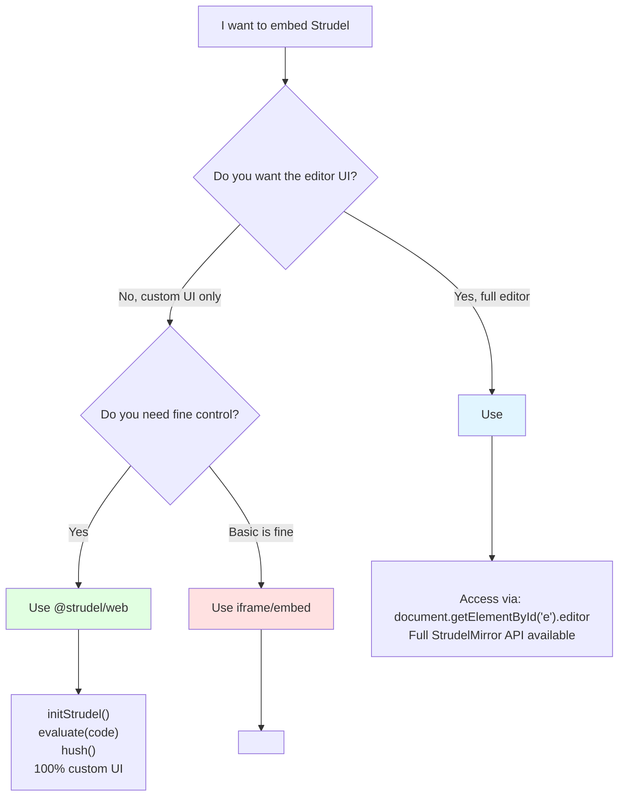

# Strudel Embedding - Quick Reference

## Decision Tree



---

## 4 Embedding Methods

### 1. Full REPL Component (`<strudel-editor>`)

**Best for:** Embedding the full Strudel experience with optional customization

```html
<script src="https://unpkg.com/@strudel/repl@latest"></script>
<strudel-editor id="myEditor">
  <!-- note("c e g").s("piano") -->
</strudel-editor>

<script>
  const editor = document.getElementById('myEditor').editor;
  editor.setCode('note("c a f e").s("piano")');
  editor.evaluate();
</script>
```

**Control API:**
- `editor.setCode(code)` - Update code
- `editor.evaluate()` - Play
- `editor.stop()` - Stop
- `editor.toggle()` - Toggle play/stop
- `editor.code` - Get current code
- `editor.repl.scheduler.started` - Check if playing

---

### 2. Iframe Embed (`@strudel/embed`)

**Best for:** Quick embedding with zero setup

```html
<script src="https://unpkg.com/@strudel/embed@latest"></script>
<strudel-repl>
  <!-- note("c e g").s("piano") -->
</strudel-repl>
```

**Or direct iframe:**
```html
<iframe src="https://strudel.cc/?xwWRfuCE8TAR" width="800" height="600"></iframe>
```

**Control:** Limited (iframe sandbox)

---

### 3. Headless (`@strudel/web`) ⭐ RECOMMENDED FOR CUSTOM UI

**Best for:** Complete custom UI, no editor

```html
<script src="https://unpkg.com/@strudel/web@latest"></script>

<!-- Your custom UI -->
<button id="play">Play</button>
<button id="stop">Stop</button>

<script>
  initStrudel();
  
  document.getElementById('play').addEventListener('click', () => {
    evaluate('note("c e g").s("piano")');
  });
  
  document.getElementById('stop').addEventListener('click', () => {
    hush();
  });
</script>
```

**API:**
- `initStrudel(options)` - Initialize once
- `evaluate(code, autostart=true)` - Evaluate pattern
- `hush()` - Stop all patterns
- All pattern functions: `note()`, `s()`, `stack()`, etc.

---

### 4. Manual npm Integration

**Best for:** Custom build pipeline, tree-shaking

```bash
npm install @strudel/core @strudel/webaudio @strudel/transpiler
```

```javascript
import { repl } from '@strudel/core';
import { webaudioOutput, getAudioContext } from '@strudel/webaudio';
import { transpiler } from '@strudel/transpiler';

const replInstance = repl({
  defaultOutput: webaudioOutput,
  getTime: () => getAudioContext().currentTime,
  transpiler,
});

replInstance.evaluate('note("c e g").s("piano")', true);
```

---

## Comparison Chart

| Method | UI Included | Control Level | Setup | Bundle Size |
|--------|-------------|---------------|-------|-------------|
| `<strudel-editor>` | ✅ Full | ⭐⭐⭐ High | ⭐ Easy | Medium |
| `@strudel/embed` | ✅ Iframe | ⭐ Low | ⭐⭐⭐ Easiest | Small |
| `@strudel/web` | ❌ None | ⭐⭐⭐ High | ⭐⭐ Easy | Small |
| npm packages | ❌ None | ⭐⭐⭐ Maximum | ⭐ Complex | Smallest |

---

## Common Patterns

### Pattern 1: Hidden Editor (Audio Engine Only)

```html
<!-- Hidden editor for audio engine -->
<strudel-editor id="engine" style="display: none;"></strudel-editor>

<!-- Your custom UI -->
<button onclick="play()">Play</button>
<button onclick="stop()">Stop</button>

<script>
  const engine = document.getElementById('engine').editor;
  
  function play() {
    engine.setCode('note("c e g").s("piano")');
    engine.evaluate();
  }
  
  function stop() {
    engine.stop();
  }
</script>
```

### Pattern 2: Custom Controls Over Editor

```html
<!-- Custom controls -->
<div id="controls">
  <button onclick="playPattern()">Play</button>
  <button onclick="stopPattern()">Stop</button>
  <select id="presets" onchange="loadPreset()">
    <option value="piano">Piano</option>
    <option value="drums">Drums</option>
  </select>
</div>

<!-- Visible editor -->
<strudel-editor id="editor"></strudel-editor>

<script>
  const presets = {
    piano: 'note("c e g b").s("piano")',
    drums: 's("bd sd hh sd")'
  };
  
  function playPattern() {
    document.getElementById('editor').editor.evaluate();
  }
  
  function stopPattern() {
    document.getElementById('editor').editor.stop();
  }
  
  function loadPreset() {
    const preset = document.getElementById('presets').value;
    document.getElementById('editor').editor.setCode(presets[preset]);
  }
</script>
```

### Pattern 3: Pure Custom UI (Headless)

```html
<script src="https://unpkg.com/@strudel/web@latest"></script>

<div id="app">
  <textarea id="code">note("c e g").s("piano")</textarea>
  <button id="play">Play</button>
  <button id="stop">Stop</button>
  <div id="status">Stopped</div>
</div>

<script>
  initStrudel();
  
  document.getElementById('play').onclick = () => {
    const code = document.getElementById('code').value;
    evaluate(code);
    document.getElementById('status').textContent = 'Playing';
  };
  
  document.getElementById('stop').onclick = () => {
    hush();
    document.getElementById('status').textContent = 'Stopped';
  };
</script>
```

---

## API Cheat Sheet

### `<strudel-editor>` API

```javascript
const editor = document.getElementById('myEditor').editor;

// Code control
editor.setCode(code)                  // Set code
editor.appendCode(code)               // Append code
editor.code                           // Get code (property)

// Playback control
editor.evaluate(autostart=true)       // Evaluate & play
editor.stop()                         // Stop
editor.toggle()                       // Toggle play/stop

// State
editor.repl.scheduler.started         // Is playing? (boolean)

// Events
document.dispatchEvent(new CustomEvent('repl-evaluate'));
document.dispatchEvent(new CustomEvent('repl-stop'));
```

### `@strudel/web` API

```javascript
// Initialization (call once)
initStrudel({
  prebake: () => samples('github:tidalcycles/dirt-samples')
});

// Playback
evaluate(code, autostart=true)        // Evaluate pattern
hush()                                 // Stop all

// Pattern creation
note(pattern)                          // Note pattern
s(pattern)                             // Sound pattern
stack(...patterns)                     // Stack patterns
// ... all Strudel functions available
```

---

## Version Pinning

```html
<!-- Latest (auto-updates) -->
<script src="https://unpkg.com/@strudel/web@latest"></script>

<!-- Specific version (stable) -->
<script src="https://unpkg.com/@strudel/web@1.0.3"></script>

<!-- For production, use specific version! -->
```

---

## Loading Samples

```javascript
// Option 1: Via initStrudel
initStrudel({
  prebake: () => samples('github:tidalcycles/dirt-samples')
});

// Option 2: Load on demand
samples('github:tidalcycles/dirt-samples');

// Option 3: Custom samples
samples({
  mysamples: {
    kick: 'https://example.com/kick.wav',
    snare: 'https://example.com/snare.wav'
  }
});
```

---

## Troubleshooting

### Editor not responding
```javascript
// Make sure to access .editor property
const wrong = document.getElementById('myEditor');
const correct = document.getElementById('myEditor').editor;
```

### Autoplay blocked
```javascript
// Must be triggered by user interaction
button.addEventListener('click', () => {
  evaluate(code);  // ✅ Works
});

// Won't work on page load
evaluate(code);  // ❌ Blocked by browser
```

### Samples not loading
```javascript
// Wait for samples to load
initStrudel({
  prebake: async () => {
    await samples('github:tidalcycles/dirt-samples');
    console.log('Samples loaded!');
  }
});
```

---

## React Example

```jsx
import { useEffect, useState } from 'react';
import { initStrudel, evaluate, hush } from '@strudel/web';

function StrudelPlayer() {
  const [code, setCode] = useState('note("c e g").s("piano")');
  const [playing, setPlaying] = useState(false);
  
  useEffect(() => {
    initStrudel();
  }, []);
  
  const play = () => {
    evaluate(code);
    setPlaying(true);
  };
  
  const stop = () => {
    hush();
    setPlaying(false);
  };
  
  return (
    <div>
      <textarea value={code} onChange={e => setCode(e.target.value)} />
      <button onClick={play}>Play</button>
      <button onClick={stop}>Stop</button>
      <p>Status: {playing ? 'Playing' : 'Stopped'}</p>
    </div>
  );
}
```

---

## Resources

- **Strudel Website:** https://strudel.cc
- **Docs:** https://strudel.cc/learn
- **npm Packages:** https://www.npmjs.com/search?q=%40strudel
- **Repository:** https://codeberg.org/uzu/strudel
- **Discord:** https://discord.com/invite/HGEdXmRkzT

---

## Your Best Bet

Based on your needs (custom UI, separate controls, hide editor):

### ⭐ Recommended: `@strudel/web`

```html
<!DOCTYPE html>
<html>
<head>
  <title>My Strudel App</title>
</head>
<body>
  <!-- Your custom UI -->
  <button id="play">Play Pattern</button>
  <button id="stop">Stop</button>
  
  <!-- Load Strudel -->
  <script src="https://unpkg.com/@strudel/web@latest"></script>
  
  <script>
    initStrudel();
    
    document.getElementById('play').onclick = () => {
      evaluate('note("c e g b").s("piano")');
    };
    
    document.getElementById('stop').onclick = () => {
      hush();
    };
  </script>
</body>
</html>
```

**Why:** 
- No editor UI at all
- Full programmatic control
- Lightweight
- Easy to integrate with your custom UI
- Perfect for your use case!
