# Strudel MIDI Streaming Architecture - Complete Stack

**Date:** 2025-12-25  
**Purpose:** Deep dive into the entire MIDI streaming system from pattern evaluation to MIDI output

---

## Overview

This document provides comprehensive Mermaid diagrams showing every layer of the MIDI streaming system in Strudel, from high-level pattern code down to the browser's WebMIDI API and hardware MIDI output.

---

## 1. High-Level System Architecture

```mermaid
graph TB
    subgraph "User Code Layer"
        A["User Pattern Code<br/>note('c e g').midi()"]
    end
    
    subgraph "Pattern Engine Layer"
        B[Pattern Class<br/>@strudel/core]
        C[Pattern Methods<br/>.midi() .midichan() .ccn()]
    end
    
    subgraph "Scheduler Layer"
        D[Cyclist/NeoCyclist<br/>Event Scheduler]
        E[Zyklus Clock<br/>Timing Engine]
    end
    
    subgraph "MIDI Layer"
        F[MIDI Package<br/>@strudel/midi]
        G[WebMIDI.js Library]
    end
    
    subgraph "Browser Layer"
        H[Web MIDI API<br/>navigator.requestMIDIAccess]
    end
    
    subgraph "OS Layer"
        I[OS MIDI Driver<br/>CoreMIDI/ALSA/Windows MIDI]
    end
    
    subgraph "Hardware Layer"
        J[MIDI Device<br/>Synth/Interface/DAW]
    end
    
    A --> B
    B --> C
    C --> D
    D --> E
    E --> F
    F --> G
    G --> H
    H --> I
    I --> J
    
    style A fill:#e1f5ff
    style J fill:#ffe1e1
```

---

## 2. Pattern Evaluation Flow


---

## 3. Scheduler Timing System (Zyklus + Cyclist)


**Key Timing Variables:**

```javascript
// From cyclist.mjs
targetTime = (hap.whole.begin - num_cycles_at_cps_change) / cps 
           + seconds_at_cps_change 
           + latency

// Example:
// hap.whole.begin = 2.5 (cycles)
// num_cycles_at_cps_change = 0
// cps = 0.5 (120 BPM)
// seconds_at_cps_change = 10.0
// latency = 0.1
// targetTime = (2.5 - 0) / 0.5 + 10.0 + 0.1 = 15.1 seconds
```

---

## 4. MIDI Package Architecture


---

## 5. scheduleAtTime() - Precision Timing System


**Why ConstantSourceNode?**

- **AudioScheduledSourceNode** has precise scheduling via `.start()` and `.stop()`
- **onended event** fires exactly at scheduled stop time
- **Web Audio Clock** is sample-accurate (much more precise than setTimeout)
- **Hack but effective**: We don't use the audio signal, just the timing

---

## 6. MIDI Message Flow (Note Example)


---

## 7. MIDI Control Mapping (midimap) Flow


**normalize() Function:**

```javascript
function normalize(value, min, max, exp) {
  let normalized = (value - min) / (max - min)
  normalized = Math.min(1, Math.max(0, normalized))  // Clamp 0-1
  return Math.pow(normalized, exp)  // Apply exponential curve
}

// Example:
// lpf: 1000, min: 0, max: 20000, exp: 0.5
// normalized = (1000 - 0) / (20000 - 0) = 0.05
// exponential = 0.05 ** 0.5 = 0.2236
// cc_value = Math.round(0.2236 * 127) = 28
```

---

## 8. WebMIDI.js to Browser API


**MIDI Message Byte Structure:**

```
Note ON:  [0x90 + channel-1, note_number, velocity]
Note OFF: [0x80 + channel-1, note_number, 0]
CC:       [0xB0 + channel-1, cc_number, cc_value]
Program:  [0xC0 + channel-1, program_number]

Example:
Note C4 (60) on channel 1 with velocity 100:
[0x90, 0x3C, 0x64]
 144,  60,  100
```

---

## 9. Browser to OS to Hardware


---

## 10. Complete Data Flow (End-to-End)

```mermaid
graph TB
    subgraph "1. User Code"
        A["note('c4 e4 g4')<br/>.midichan(1)<br/>.velocity(0.8)<br/>.midi('IAC')"]
    end
    
    subgraph "2. Pattern Construction"
        B[Pattern.note 'c4 e4 g4']
        C[.midichan 1]
        D[.velocity 0.8]
        E[.midi 'IAC']
    end
    
    subgraph "3. MIDI Setup"
        F[enableWebMidi]
        G[Add onTrigger callback]
        H[Store config<br/>device, channel, velocity]
    end
    
    subgraph "4. Scheduler Start"
        I[scheduler.setPattern pattern]
        J[scheduler.start]
        K[Zyklus clock.start]
    end
    
    subgraph "5. Clock Tick (Every 100ms)"
        L[Calculate begin/end cycles]
        M[pattern.queryArc begin, end]
        N[Returns Haps]
    end
    
    subgraph "6. For Each Hap"
        O[Hap: note='c4', velocity=0.8]
        P[Calculate targetTime<br/>cycle/cps + phase + latency]
        Q[Call hap.context.onTrigger]
    end
    
    subgraph "7. MIDI onTrigger"
        R[Extract: note, velocity, channel]
        S[Get device: 'IAC']
        T[Convert note: 'c4' → 60]
        U[Create Note object]
        V[Call sendNote]
    end
    
    subgraph "8. Scheduling"
        W[scheduleAtTime callback, targetTime]
        X[Create ConstantSourceNode]
        Y[node.start currentTime]
        Z[node.stop targetTime]
    end
    
    subgraph "9. At Target Time"
        AA[onended fires]
        AB[device.playNote note, channel]
        AC[WebMIDI.js splits to ON/OFF]
    end
    
    subgraph "10. Web MIDI API"
        AD[MIDIOutput.send<br/>[0x90, 60, 102]]
        AE[Timestamp: targetTime]
    end
    
    subgraph "11. OS MIDI"
        AF[CoreMIDI/ALSA/Windows]
        AG[IAC Driver routing]
    end
    
    subgraph "12. Destination"
        AH[DAW receives MIDI]
        AI[Records to MIDI track]
        AJ[Plays synth sound]
    end
    
    A --> B
    B --> C
    C --> D
    D --> E
    E --> F
    F --> G
    G --> H
    H --> I
    I --> J
    J --> K
    K --> L
    L --> M
    M --> N
    N --> O
    O --> P
    P --> Q
    Q --> R
    R --> S
    S --> T
    T --> U
    U --> V
    V --> W
    W --> X
    X --> Y
    Y --> Z
    Z --> AA
    AA --> AB
    AB --> AC
    AC --> AD
    AD --> AE
    AE --> AF
    AF --> AG
    AG --> AH
    AH --> AI
    AI --> AJ
    
    style A fill:#e1f5ff
    style AJ fill:#ffe1e1
```

---

## 11. Timing Precision Breakdown

```mermaid
graph TB
    subgraph "Timing Layers"
        A[JavaScript setInterval<br/>~100ms precision<br/>±10ms jitter]
        B[Zyklus Lookahead<br/>Queries future events<br/>100-200ms ahead]
        C[Web Audio Clock<br/>Sample-accurate<br/>44.1kHz = 0.023ms precision]
        D[ConstantSourceNode Scheduling<br/>Exact timing via .stop<br/>Sub-millisecond accuracy]
        E[WebMIDI Timestamp<br/>DOMHighResTimeStamp<br/>Microsecond precision]
        F[OS MIDI Driver<br/>Platform-dependent<br/>~1ms precision]
    end
    
    subgraph "Precision Levels"
        G[Coarse: 100ms intervals]
        H[Medium: Lookahead buffering]
        I[Fine: Web Audio scheduling]
        J[Ultra-fine: MIDI timestamps]
    end
    
    A --> B
    B --> C
    C --> D
    D --> E
    E --> F
    
    A -.-> G
    B -.-> H
    C -.-> I
    D -.-> I
    E -.-> J
    
    style C fill:#e1ffe1
    style D fill:#e1ffe1
```



**Why This Works:**

1. **setInterval (100ms)**: Coarse timing, but we don't care - it's just for triggering queries
2. **Lookahead**: Query events 100-200ms in the future, buffer them
3. **Web Audio Scheduling**: ConstantSourceNode scheduled with sample-accurate timing
4. **onended callback**: Fires at exact scheduled time, sends MIDI
5. **WebMIDI timestamp**: Further precision for OS-level MIDI timing

**Result**: Despite JavaScript's poor timing, MIDI output is sample-accurate!

---

## 12. Key Files and Their Roles


---

## 13. Desktop App MIDI (Alternative Path)


**Key Difference**: Desktop app bypasses WebMIDI API, uses native MIDI via Rust

---

## Summary: The Complete Stack

| Layer | Component | Timing Precision | Purpose |
|-------|-----------|------------------|----------|
| **1. User Code** | `note("c").midi()` | N/A | Define patterns |
| **2. Pattern Engine** | Pattern class | N/A | Build pattern AST |
| **3. Scheduler** | Cyclist | ~100ms intervals | Query future events |
| **4. Clock** | Zyklus | 100ms lookahead | Trigger scheduler |
| **5. Pattern Query** | queryArc() | N/A | Get events in time range |
| **6. MIDI Package** | .midi() onTrigger | N/A | Convert haps to MIDI |
| **7. Scheduling** | scheduleAtTime() | Sample-accurate | Precise timing |
| **8. Web Audio** | ConstantSourceNode | 0.023ms (44.1kHz) | Timing mechanism |
| **9. WebMIDI.js** | WebMidi library | N/A | MIDI abstraction |
| **10. Browser API** | Web MIDI API | Microsecond | Browser MIDI interface |
| **11. OS Driver** | CoreMIDI/ALSA/Win | ~1ms | OS MIDI handling |
| **12. Hardware** | MIDI device | N/A | Sound output |

---

## Key Insights

1. **Lookahead Architecture**: Events are queried 100-200ms ahead, then scheduled precisely
2. **Web Audio Timing**: Uses Web Audio's sample-accurate scheduling for MIDI (clever hack!)
3. **No Direct File Export**: System is designed for real-time streaming only
4. **Multiple Precision Layers**: Coarse JavaScript timing → Fine Web Audio timing → Ultra-fine MIDI timestamps
5. **Separation of Concerns**: Pattern logic separate from timing separate from MIDI output
6. **Extensible**: Easy to add new MIDI message types (already has notes, CC, program change, SysEx, etc.)

---

## How to Own This Stack

If you want to fully control the MIDI streaming system:

### Option 1: Fork and Modify
- Fork `packages/midi/midi.mjs`
- Modify `sendNote()`, `sendCC()`, etc.
- Add custom MIDI routing logic
- Add MIDI file export (write to .mid during playback)

### Option 2: Custom Scheduler
- Implement your own Cyclist/NeoCyclist
- Replace `scheduleAtTime()` with custom timing
- Add MIDI recording buffer

### Option 3: Intercept at onTrigger
- Hook into `Pattern.prototype.midi`
- Capture all MIDI messages before sending
- Write to file, send to network, etc.

### Option 4: Desktop App
- Use Tauri app approach (`@strudel/desktopbridge`)
- Full control over native MIDI
- Can write to files directly

---

**You now understand every layer of the MIDI streaming system!** 🎹
